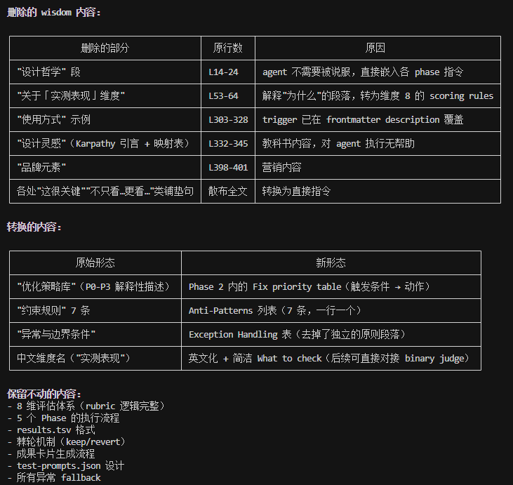

# Day 1

### 想法

观感：原版autoresearch用于模型训练，是有一个明确的数值指标的，然后不断迭代以达到指标；但这个darwin是针对8个维度按照分数高低进行依次改进，只要改进后得分更好就进入下一个维度，相当于进行了8次固定改进，缺少了“auto”的感觉

* 针对人在回路——去看看AutoR有什么可取的地方；以及Hamel 的 Evals Course Reader，还有Error Analysis 四步法。Open coding：在多样输入上跑 Skill，亲自读每条输出，自由记录什么不对。Axial coding：把笔记归纳成连贯的失败分类法——太抽象、漏掉企业约束、细节粒度不对。基于分类法写评判标准。手动给 15-20 条输出打分验证标准和自己判断是否一致

* 针对评分用子agent——去看看ARIS的双agent模式（博弈/纳什均衡机制？） √done

* 输入/测评维度——去看看Hamel Husain 的 evals-skills 生成合成评估  √done

---

### 修改尝试

**重写md文件，精炼：**

* 

**层次 1：评分体系——从"人打分"到"法官判案"** 

  达芬奇原始版的效果评估：agent 看输出 → 感觉好不好 → 打 1-10 分。这是艺术。

  升级后：每个被测试的能力点预先写好 pass 条件和 fail 条件（都是机械可判定的陈述句），独立 judge agent逐条对照，输出 PASS 或 FAIL。然后 pass_rate × 25 = 效果分。这是工程。

  关键差异不在分数本身，在于三点：

  - 可复现：同一套 test-suite + criteria，任何人/任何时间跑，结果应该一样
  - 可归因：分数从 62.5% 涨到 75%，你清楚地知道是第 3 号和第 4 号用例从 FAIL 变成了 PASS，而不仅仅是"+6 分"  
  - 可校准：judge 准不准不是靠信任，是靠 TPR/TNR 数据

  **层次 2：测试设计——从"脑暴 prompt"到"维度×元组"**

  原来的 test-prompts.json 依赖操作者当时能想到什么就用什么，覆盖范围随机。

  升级后用 generate-synthetic-data 的方法论：定义 3 个与失败模式相关的维度 → 每个维度 2-4 个值 →
  笛卡尔积随机采样 ~12 个元组 → 每个元组展开为一个可判定测试用例。用户参与的时机从"审
  prompt"前移到了"审维度和元组"——这一步更早介入，但判断负担更轻（判断一个元组组合是否合理，比判断一个 prompt 
  是否合适容易）。

  这解决了：一个 skill 宣称它能处理 X 场景，但测试集里从来没有覆盖过 X 场景，于是就永远不会发现它的 X
  能力是假的。

  **层次 3：文档质量——meta-skill.md 原则内化**

  这个不是功能变化，是 SKILL.md 本身的写作质量。核心变化：

  - 所有解释"为什么这样做"的文字被删除，只保留"做什么"——因为执行 skill 的 agent 不需要被说服
  - 把"警告"和"建议"转成了"Anti-Patterns"（一行一个）和 exception handling 的具体 fallback 动作
  - 没有引言、没有引用、没有名人名言、没有"本 skill 的设计对应 autoresearch 的哪个组件"
  - 所有表格、步骤、条件判断都是 agent 可以直接机械执行的

# Day 3
  需要一个新的agent来做评估，而不是dry-run